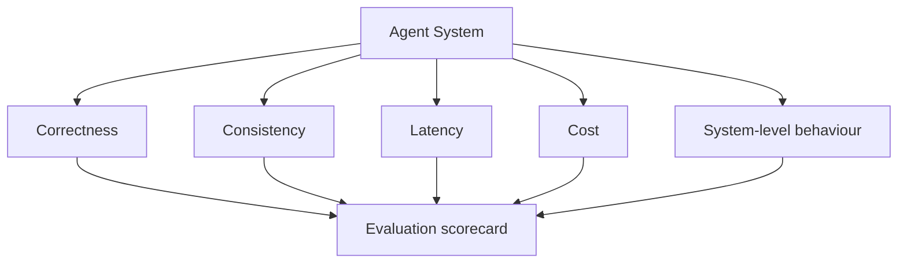

# AI Agent Evaluation Framework

A practical framework for evaluating multi-agent and agentic AI systems at the system level — not just individual outputs.

---

## Why this exists

Many teams evaluate only individual agent outputs and ignore whether the full system is actually reliable, efficient, and operationally viable.

This framework focuses on what matters for production: Can the system produce reliable outcomes repeatedly, within acceptable latency and cost constraints?

---

## The 5 evaluation dimensions

| Dimension | What to assess | Document |
|-----------|---------------|---------|
| **Correctness** | Accuracy and faithfulness of outputs | `docs/correctness.md` |
| **Consistency** | Stability across repeated runs | `docs/consistency.md` |
| **Latency** | Response time under realistic load | `docs/latency.md` |
| **Cost** | Token spend, API calls, infrastructure | `docs/cost.md` |
| **System-level behaviour** | Retry patterns, fallback, escalation | `docs/system-level-evaluation.md` |

---

## Getting started

1. Define what "good" looks like for each dimension in your system
2. Use `templates/evaluation-scorecard.md` to assess a candidate design
3. Use `templates/experiment-log.md` to track evaluations over time
4. See `examples/support-agent-comparison.md` for a worked comparison

---

## Design principle

> A strong agent system is not just capable of producing a good answer once. It should produce reliable outcomes repeatedly, within acceptable latency and cost constraints.

---

## Companion repositories

- **[Agent System Simulator](https://github.com/simaba/agent-system-simulator)** — outputs latency, cost, and evaluation metrics that map directly to this framework
- **[Multi-Agent Governance Framework](https://github.com/simaba/multi-agent-governance-framework)** — governance design that shapes what you evaluate

---

## Related repositories

This repository is part of a connected toolkit for responsible AI operations:

| Repository | Purpose |
|-----------|---------|
| [Enterprise AI Governance Playbook](https://github.com/simaba/enterprise-ai-governance-playbook) | End-to-end AI operating model from intake to improvement |
| [AI Release Governance Framework](https://github.com/simaba/ai-release-governance-framework) | Risk-based release gates for AI systems |
| [AI Release Readiness Checklist](https://github.com/simaba/ai-release-readiness-checklist) | Risk-tiered pre-release checklists with CLI tool |
| [AI Accountability Design Patterns](https://github.com/simaba/ai-accountability-design-patterns) | Patterns for human oversight and escalation |
| [Multi-Agent Governance Framework](https://github.com/simaba/multi-agent-governance-framework) | Roles, authority, and escalation for agent systems |
| [Multi-Agent Orchestration Patterns](https://github.com/simaba/multi-agent-orchestration-patterns) | Sequential, parallel, and feedback-loop patterns |
| [AI Agent Evaluation Framework](https://github.com/simaba/ai-agent-evaluation-framework) | System-level evaluation across 5 dimensions |
| [Agent System Simulator](https://github.com/simaba/agent-system-simulator) | Runnable multi-agent simulator with governance controls |
| [LLM-powered Lean Six Sigma](https://github.com/simaba/LLM-powered-Lean-Six-Sigma) | AI copilot for structured process improvement |

---

*Shared in a personal capacity. Open to collaborations and feedback — connect on [LinkedIn](https://linkedin.com/in/simaba) or [Medium](https://medium.com/@bagheri.sima).*
